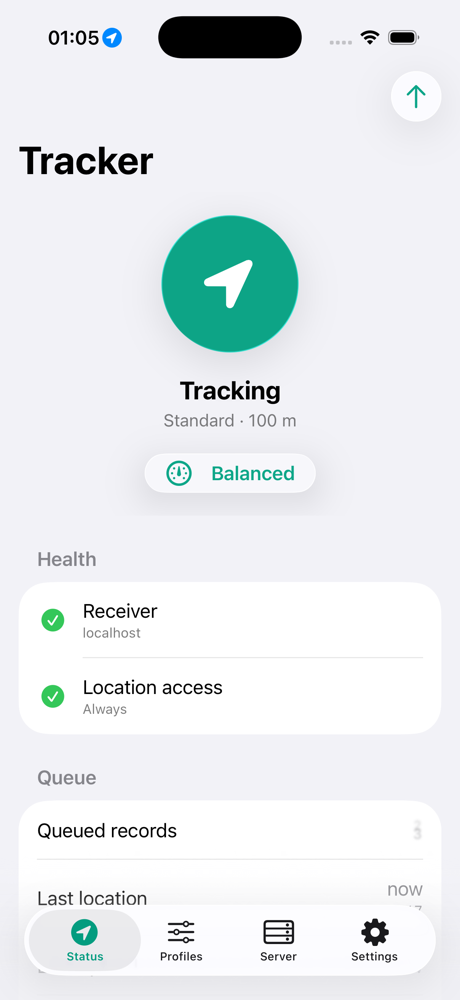
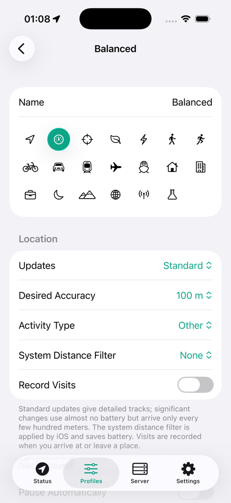
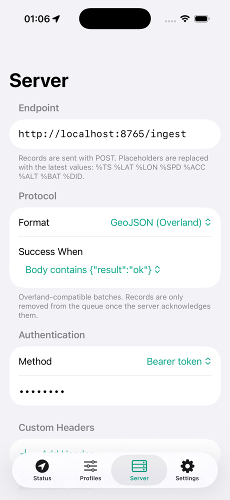
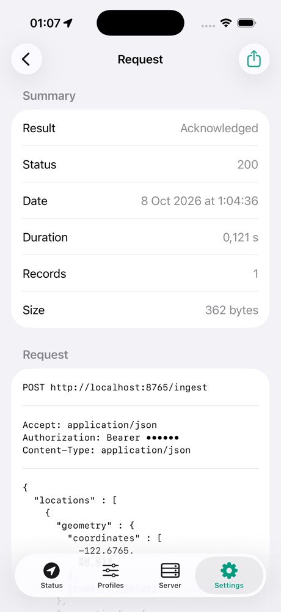

# Tracker

**Background location logging for iOS that sends your data to your own server, with every setting under your control.**

Tracker records your location in the background, queues it on the device, and uploads it in batches to an HTTP endpoint you control. It's built for people who want their location data in their own systems (a self-hosted timeline, a home-automation hub, a data warehouse) and who want control over exactly what's captured, when, and how it's sent.

It's a modern rewrite of [Overland](https://github.com/aaronpk/Overland-iOS) by Aaron Parecki, built with SwiftUI and Liquid Glass for iOS 26, and its GeoJSON output is wire-compatible with Overland receivers.

<p align="center">
  
  
  
  
</p>

> [!IMPORTANT]
> Tracker isn't publicly available yet. It's not on the App Store or TestFlight, so for now the only way to use it is to [build it from source](#getting-started).

> [!NOTE]
> "Tracker" is a working title. Website: [lucaazalim.github.io/tracker](https://lucaazalim.github.io/tracker/)

## Contents

- [Highlights](#highlights)
- [Getting started](#getting-started)
- [How it works](#how-it-works)
- [Configuration reference](#configuration-reference)
- [Receiver protocol](#receiver-protocol)
- [Setup links and QR codes](#setup-links-and-qr-codes)
- [Shortcuts](#shortcuts)
- [Compatible receivers](#compatible-receivers)
- [Coming from Overland](#coming-from-overland)
- [Alternatives](#alternatives)
- [Architecture](#architecture)
- [Development](#development)
- [Privacy](#privacy)
- [License](#license)

## Highlights

- **Profiles.** Named sets of capture, upload and payload settings, such as *Balanced*, *High resolution* and *Battery saver*. You can switch profiles in the app, from Shortcuts, or from your server.
- **Full Core Location control.** Standard and significant-change updates, visits, desired accuracy, activity type, the iOS distance filter, automatic pausing, a resume geofence (built on `CLMonitor`), and the background location indicator.
- **Per-field payloads.** Turn each property on or off individually. Every toggle shows the JSON key it controls, and a live preview shows the exact record that will be sent.
- **A reliable offline queue.** Records are stored in SQLite and deleted only after the server acknowledges them. Retention limits keep an unreachable server from filling the device.
- **Flexible delivery.** Overland-style GeoJSON batches or OwnTracks objects, with bearer, basic or custom-header authentication and URL placeholders like `%LAT`.
- **Remote configuration.** Your server can adjust settings or switch profiles through its response.
- **A request inspector.** The last 200 requests, with headers, bodies and responses, and credentials masked.
- **Import and export.** Share a configuration as JSON, as a link, or as a QR code. Every import is reviewed before it's applied.
- **Health checks.** Permission, precise location, Background App Refresh, Low Power Mode and receiver status on one screen, plus a watchdog notification if tracking stops.
- **Wi-Fi zones.** While connected to a known network, record a fixed coordinate (no GPS drift at home) or record nothing.
- **No third-party dependencies, no analytics, no accounts.**

## Getting started

### Requirements

- Xcode 26 or later
- iOS 26 or later (iPhone or iPad)
- A receiver endpoint. For local testing, use the bundled [`scripts/dev-receiver.py`](scripts/dev-receiver.py).

### Build and run

```bash
git clone https://github.com/lucaazalim/tracker.git
```

```bash
open tracker/Tracker.xcodeproj
```

Select an iPhone simulator and run (⌘R). You can simulate movement in the Simulator under **Features → Location**, or from the command line:

```bash
xcrun simctl location booted start --speed=15 45.5230,-122.6765 45.5300,-122.6650
```

### Run on a device

Signing settings live in an untracked xcconfig, so your team ID never ends up in a commit:

```bash
cp Config/Signing.local.xcconfig.example Config/Signing.local.xcconfig
```

Then set `DEVELOPMENT_TEAM` and a unique `TRACKER_BUNDLE_ID_PREFIX` in that file. To find your team ID, pick your team once under *Signing & Capabilities* and read `DEVELOPMENT_TEAM` from `git diff`, then revert the project change.

A free Apple ID ("Personal Team") works for everything except Wi-Fi network names, because the *Access Wi-Fi Information* capability requires a paid developer account. With a free account, uncomment the `CODE_SIGN_ENTITLEMENTS` line in your `Signing.local.xcconfig` to use `Config/Tracker-PersonalTeam.entitlements`. Apps signed with a free account expire after 7 days; run them from Xcode again to renew.

### Try it with the development receiver

```bash
python3 scripts/dev-receiver.py --port 8080 --token secret
```

Then open this link on the device or simulator. Tracker shows a review screen before applying it.

```bash
xcrun simctl openurl booted "tracker://setup?url=http%3A%2F%2Flocalhost%3A8080%2F&token=secret&device_id=simulator"
```

Turn tracking on, then open the receiver's address (e.g. `http://localhost:8080/`) in a browser. Its dashboard shows a live feed of every request, with the records, the raw body and the response, plus a map of the track. The receiver can also simulate failures (`--fail`) and push remote configuration (`--set '{"send_interval":"1m"}'`).

> [!CAUTION]
> The dashboard has no authentication. Anyone who can reach the port can see your location. Pass `--host 127.0.0.1` to keep it on your machine.

## How it works

```
Core Location ──▶ filters ──▶ payload builder ──▶ SQLite queue ──▶ uploader ──▶ your server
  (profile)     (distance,     (format, field                      (batches,       │
                 time, Wi-Fi)   toggles)                            auth, ack)  ◀───┘ optional "set"
```

1. **Capture.** The active profile configures `CLLocationManager`: update mode, accuracy, activity type, distance filter, pausing and the indicator. Visits and motion activity are collected when they're enabled.
2. **Filter.** Points closer than the profile's minimum distance or interval to the previous recorded point are dropped. Wi-Fi zones can replace or suppress points.
3. **Queue.** Each record is serialized once and appended to the SQLite queue. With the *Latest only* strategy, the newest location replaces older queued ones.
4. **Upload.** When a location arrives and the send interval has elapsed, or when you tap *Send Now*, or during a background app refresh, Tracker uploads batches until the queue is empty. Each upload makes at most 25 requests.
5. **Acknowledge.** Records are deleted only after the server confirms them. Failed batches stay queued and are retried later.

## Configuration reference

### Profile: Location

| Setting | Options | Notes |
|---|---|---|
| Updates | Off · Standard · Significant changes · Standard + significant | *Off* still records visits if enabled. |
| Desired accuracy | Best for navigation · Best · 10 m · 100 m · 1 km · 3 km · Reduced | `CLLocationManager.desiredAccuracy` |
| Activity type | Other · Automotive · Fitness · Other navigation · Airborne | Hint used by iOS to decide when to pause. |
| System distance filter | None · 5 m … 1 km | `distanceFilter`. Applied by iOS, so it saves battery. |
| Record visits | on/off | `CLVisit` arrivals and departures. |

### Profile: Background

| Setting | Notes |
|---|---|
| Pause automatically | `pausesLocationUpdatesAutomatically`. Saves battery while stationary. |
| Resume with geofence | Off · 100 m … 2 km. When iOS pauses, an exit geofence is registered at the last location; leaving it restarts updates. |
| Background indicator | Shows the blue status-bar pill, which helps iOS keep the app alive. |

### Profile: Filters

| Setting | Notes |
|---|---|
| Min distance | Drop points within this distance of the previous recorded point. |
| Min interval | Drop points within this time of the previous recorded point. |

These reduce the amount of data, not battery use. To save battery, use the system distance filter or a lower accuracy instead.

### Profile: Upload

| Setting | Options |
|---|---|
| Send interval | Manual only · 1 s … 1 h |
| Batch size | 10 · 50 · 100 · 200 · 500 · 1000 records per request |
| Queue | *All points*, or *Latest only* (keep just the newest location) |

### Profile: Payload fields

Coordinates and `timestamp` are always included. Everything else can be toggled:

| Field | GeoJSON key | Default |
|---|---|---|
| Altitude | `altitude` | on |
| Floor | `floor` | off |
| Speed | `speed` | on |
| Course | `course` | on |
| Motion activity | `motion` | on |
| Horizontal / vertical / speed / course accuracy | `horizontal_accuracy` … | on |
| Battery level / state | `battery_level`, `battery_state` | on |
| Wi-Fi network | `wifi` | on |
| Profile name | `profile` | off |
| Tracking stats | `pauses`, `activity`, `desired_accuracy`, `tracking_mode`, `locations_in_payload` | off |
| Lifecycle events | separate records with an `action` | off |

### Server

| Setting | Notes |
|---|---|
| Endpoint | `http` or `https` URL. Supports [placeholders](#url-placeholders). |
| Format | GeoJSON (Overland) or OwnTracks |
| Success when | `"result": "ok"` in the body, or any 2xx status |
| Authentication | None · Bearer token · Basic |
| Custom headers | Sent with every request. They override the authentication header. |
| Device ID | Sent as `device_id`; also used as the OwnTracks topic. |
| Include unique ID | Sends iOS's `identifierForVendor` as `unique_id`. |
| Attach current location | Adds `current` when the backlog spans more than one batch. |
| Allow remote configuration | Lets the server change settings through `set`. |
| Timeout | 10 · 30 · 60 · 120 s |

### App-wide settings

- **Wi-Fi zones.** SSID, coordinate, and either *Use fixed location* or *Don't record*.
- **Notifications.** A watchdog when no location has arrived for N minutes, plus alerts for paused, resumed, upload failed, and settings changed by the server.
- **Queue and retention.** A maximum number of records and a maximum age. The oldest records are dropped first.

## Receiver protocol

### GeoJSON (Overland-compatible)

```http
POST /your/endpoint HTTP/1.1
Authorization: Bearer <token>
Content-Type: application/json

{
  "locations": [
    {
      "type": "Feature",
      "geometry": { "type": "Point", "coordinates": [-122.6764816, 45.5230622] },
      "properties": {
        "timestamp": "2026-10-08T12:34:56Z",
        "altitude": 15,
        "speed": 1.42,
        "course": 87,
        "horizontal_accuracy": 5,
        "vertical_accuracy": 3,
        "speed_accuracy": 0.3,
        "course_accuracy": 12,
        "motion": ["walking"],
        "battery_level": 0.82,
        "battery_state": "unplugged",
        "wifi": "HomeNetwork",
        "device_id": "phone"
      }
    }
  ],
  "current": { "...": "newest location, only when the backlog spans multiple batches" }
}
```

Coordinates are `[longitude, latitude]`, as GeoJSON specifies. Invalid speed and course values are `-1`, and `battery_level` is `null` when unknown.

**Visits** are records with `"action": "visit"`, `arrival_date` and `departure_date` (`null` while the visit is ongoing). **Lifecycle events** are records with an `action` such as `tracking_started`, `tracking_stopped`, `profile_changed`, `paused_location_updates`, `resumed_location_updates`, `exited_pause_region`, `will_terminate` or `remote_configuration_applied`. They have no `geometry` when no location is known yet.

### Acknowledgement

By default, the server must reply with a JSON object containing `"result": "ok"`. Only then are the records removed from the queue. Any other response keeps them queued for the next attempt, and an `"error"` string in the response is shown in the app. If your server can't return that body, switch *Success when* to *Any 2xx*.

### Remote configuration

Include a `set` object in a successful response to change settings on the device. This works only when *Allow remote configuration* is on. Settings apply to the **active profile**.

```json
{
  "result": "ok",
  "set": {
    "profile": "Battery saver",
    "send_interval": "5m",
    "main": {
      "tracking_mode": "standard",
      "desired_accuracy": "100m",
      "min_distance": "50m"
    }
  }
}
```

| Key | Values |
|---|---|
| `profile` | Profile name (case-insensitive) or UUID. Applied first. |
| `send_interval` | `"off"`, `"30s"`, `"5m"`, `"1h"`, or seconds as a number |
| `main.tracking_mode` | `off` · `standard` · `significant` · `both` |
| `main.visit_tracking` | `true` / `false` |
| `main.desired_accuracy` | `nav` · `best` · `10m` · `100m` · `1km` · `3km` · `reduced` |
| `main.activity_type` | `other` · `car` · `fitness` · `nav` · `air` |
| `main.background_indicator` | `true` / `false` |
| `main.pause_automatically` | `true` / `false` |
| `main.logging_mode` | `all` · `latest` |
| `main.batch_size` | number |
| `main.resume_with_geofence` | `"off"`, `"500m"`, `"2km"`, or meters |
| `main.min_distance` | `"off"`, `"10m"`, or meters |
| `main.min_time` | `"off"`, `"30s"`, `"5m"`, or seconds |

> [!WARNING]
> Sending `"send_interval": "off"` stops automatic uploads, so the device won't check in again until someone taps *Send Now*. Only send keys when you want to change them.

### URL placeholders

Placeholders in the endpoint URL are replaced with values from the most recent location. This is useful for receivers that take query parameters:

| Placeholder | Value |
|---|---|
| `%TS` | ISO 8601 timestamp |
| `%LAT`, `%LON` | Coordinates |
| `%ACC` | Horizontal accuracy (m) |
| `%SPD` | Speed (m/s) |
| `%ALT` | Altitude (m) |
| `%BAT` | Battery level (0–1) |
| `%DID` | Device ID |

```
https://example.com/log?lat=%LAT&lon=%LON&acc=%ACC&ts=%TS
```

### OwnTracks

In OwnTracks format, Tracker sends one [`_type: location`](https://owntracks.org/booklet/tech/json/#_typelocation) object per request, with `lat`, `lon`, `tst`, `acc`, `alt`, `vac`, `vel`, `cog`, `batt`, `bs`, `SSID`/`conn`, plus `topic` (`owntracks/<device id>`) and `tid`. Any 2xx response counts as success. Use *Basic* authentication for OwnTracks Recorder or Home Assistant's OwnTracks integration.

### Testing your receiver

*Server → Test Connection* sends an empty batch (`{"locations": []}`) and shows the full exchange. Nothing is removed from the queue.

## Setup links and QR codes

| Link | Purpose |
|---|---|
| `tracker://setup?url=…&token=…&device_id=…&unique_id=yes` | Quick setup, compatible with Overland's setup links. `overland://setup` links pasted into Tracker work too. |
| `tracker://import?config=…` | A complete configuration, zlib-compressed and base64url-encoded. |

*Settings → Import & Export* exports the configuration as a JSON file, a link, or a QR code that the Camera app can scan. Credentials are left out unless you include them explicitly. Every import, whether from a link, QR code, file or paste, opens a review screen first, so a malicious link can't silently redirect your location data.

## Shortcuts

Tracker provides these App Intents for the Shortcuts app and Siri:

| Action | Result |
|---|---|
| Start Tracking | – |
| Stop Tracking | – |
| Switch Profile | – |
| Upload Queued Records | Number of records sent |
| Get Queue Size | Number of queued records |

For example: *When I arrive at Work → Switch Profile to Battery saver*.

## Compatible receivers

Any receiver for Overland's GeoJSON format should work. Most of them call it "Overland", so choose their Overland endpoint or source:

- [Dawarich](https://dawarich.app/), a self-hosted alternative to Google Location History. Use its Overland endpoint, `/api/v1/overland/batches?api_key=…`.
- [GeoPulse](https://github.com/tess1o/geopulse), a self-hosted timeline. Add Overland as a GPS source.
- [Compass](https://github.com/aaronpk/Compass)
- [Wayfinder](https://github.com/dontic/wayfinder)
- [Home Assistant](https://www.home-assistant.io/integrations/owntracks/) (OwnTracks format)
- Your own receiver. [`scripts/dev-receiver.py`](scripts/dev-receiver.py) is a short starting point, with a live dashboard.

## Coming from Overland

| Overland | Tracker |
|---|---|
| Main and trip settings | Any number of **profiles** |
| Trips (modes, distance, steps) | Not included. Use profiles and Shortcuts instead. |
| Logging mode *All / Only latest / OwnTracks* | Split into *Queue strategy* (profile) and *Format* (server) |
| One Wi-Fi zone | Multiple zones, with a *Don't record* option |
| `overland://setup` | `tracker://setup` (same parameters), with a confirmation screen |
| Settings in the iOS Settings app | All in-app |
| OwnTracks `tst` in Apple's 2001 epoch, broken Basic auth | Fixed: Unix epoch and a proper Basic header |

## Alternatives

Other open-source iOS apps that send your location to a server you choose:

| App | Best for | Notes |
|---|---|---|
| [OwnTracks](https://owntracks.org/) | MQTT setups, sharing locations with friends and family, Home Assistant | Actively maintained, on iOS and Android. Fewer Core Location settings to tune. |
| [Traccar Client](https://www.traccar.org/client/) | Fleet and device tracking with a [Traccar](https://www.traccar.org/) server | Actively maintained, on iOS and Android. Built around the Traccar server's protocols. |
| [Overland](https://github.com/aaronpk/Overland-iOS) | Logging GeoJSON batches to a personal server | Doesn't seem to be actively maintained anymore: its last release was in May 2024. |

## Architecture

```
Tracker.xcodeproj
├── Tracker/                    iOS app (SwiftUI, iOS 26)
│   ├── App/                    Entry point, composition root, routing
│   ├── Services/               TrackerEngine (Core Location, motion, upload scheduling),
│   │                           ConfigurationStore, Notifier, ResumeGeofence (CLMonitor)
│   ├── Intents/                App Intents and App Shortcuts
│   └── Views/                  Status, Profiles, Server, Settings
├── Packages/TrackerKit/        Platform-independent core (Swift package)
│   ├── Configuration/          Codable models, remote configuration, import/export
│   ├── Payload/                GeoJSON and OwnTracks builders
│   ├── Storage/                SQLite-backed queue and request log (actor)
│   └── Upload/                 Batching uploader, acknowledgement, URL templates
├── Config/                     Info.plist, entitlements, xcconfig
└── scripts/dev-receiver.py     Local test receiver
```

- **TrackerKit** holds all the logic that doesn't need a device. It builds and is tested on macOS with `swift test`.
- **Swift 6** with strict concurrency throughout. The app target uses main-actor default isolation (Xcode 26's approachable concurrency).
- **Observation** (`@Observable`) for state, and **Liquid Glass** (`glassEffect`, `GlassEffectContainer`, glass button styles) for controls.
- **No dependencies.** The queue uses the system SQLite library directly and stores records pre-serialized, so a batch is assembled without re-encoding.
- **The configuration is a single Codable document.** Decoding fills in defaults for missing keys, which keeps older exports and future versions compatible.

## Development

Run the core test suite (no simulator needed):

```bash
swift test --package-path Packages/TrackerKit
```

Build the app from the command line:

```bash
xcodebuild -project Tracker.xcodeproj -scheme Tracker -destination 'generic/platform=iOS Simulator' build
```

The Xcode project uses folder-synchronized groups, so new files under `Tracker/` are picked up automatically. Contributions are welcome; see [CONTRIBUTING.md](CONTRIBUTING.md).

## Privacy

Tracker sends data only to the endpoint you configure. It has no analytics, no crash reporting, and no third-party services. Queued records and the configuration stay in the app's sandbox until they're uploaded or deleted. Plain-`http` endpoints are allowed so you can use self-hosted receivers on your local network; use `https` for anything that leaves it.

## License

[MIT](LICENSE). Inspired by [Overland](https://github.com/aaronpk/Overland-iOS) by Aaron Parecki (Apache 2.0). Tracker is a new implementation and doesn't include Overland's code.
